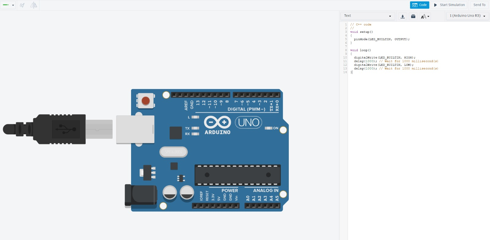
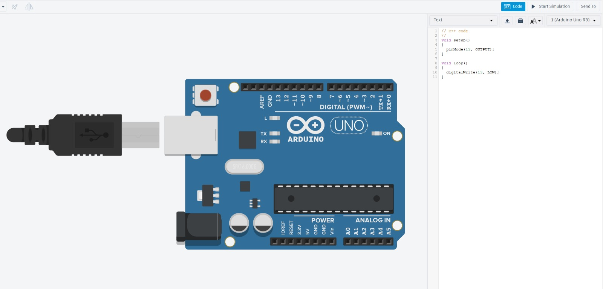
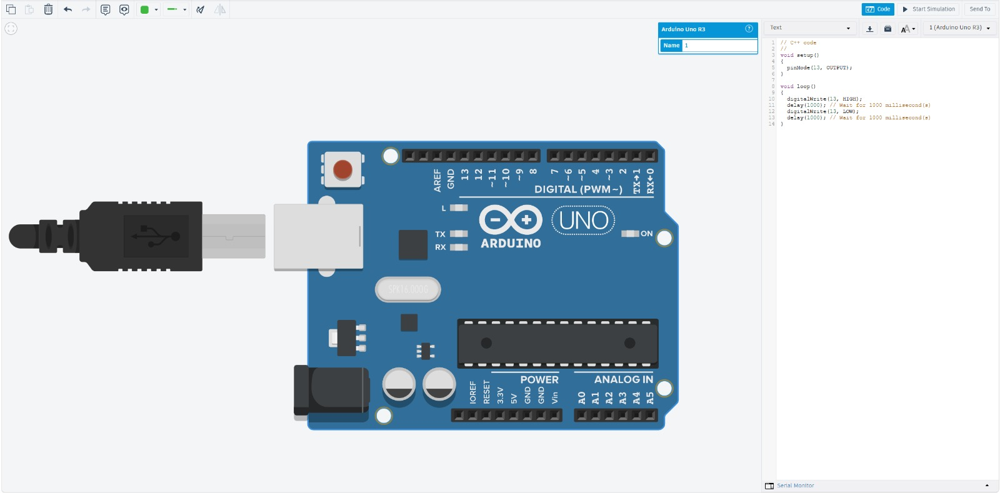
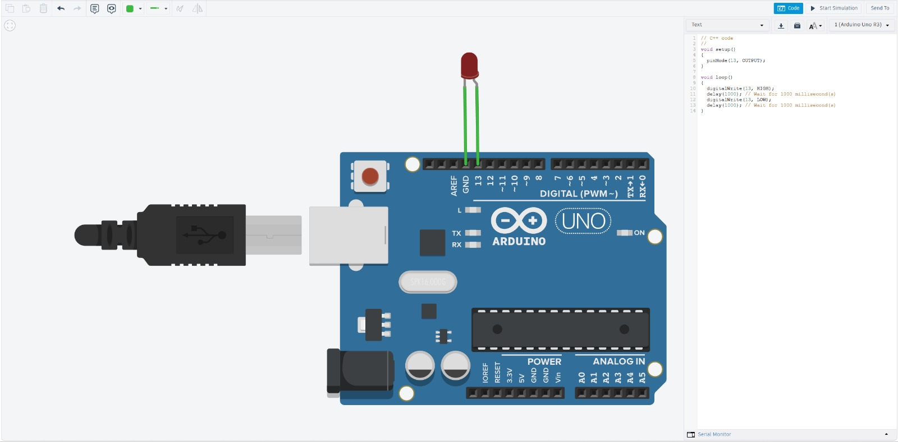
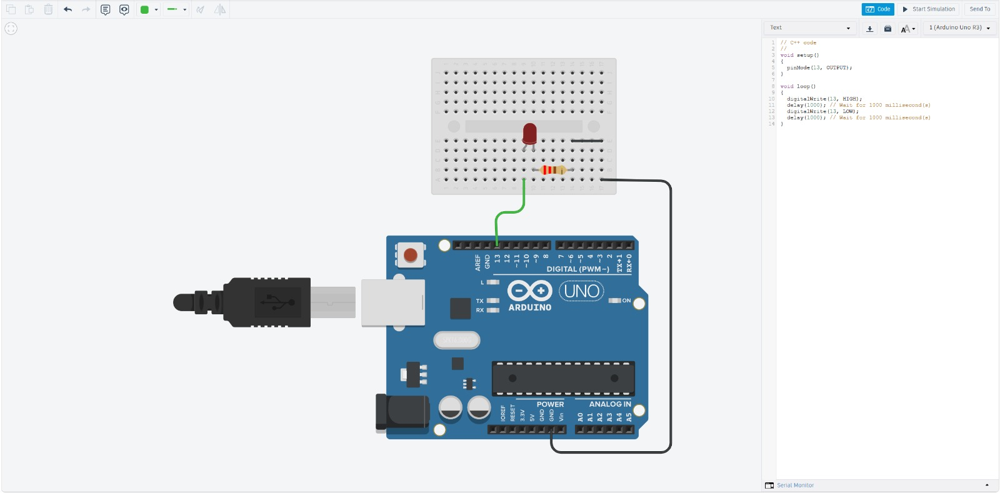
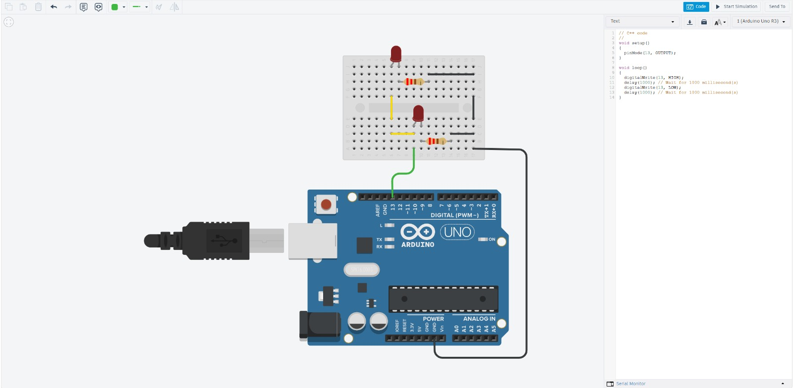
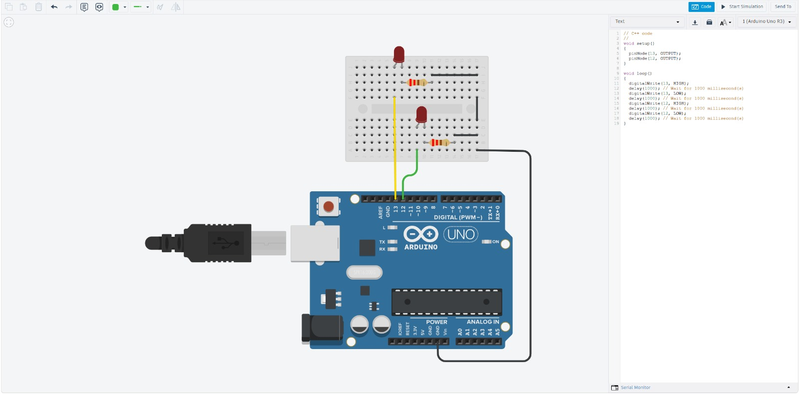

# Arduino. 
¿Qué es un arduino? 

El Arduino es un software en plataforma electrónica de código abierto, que tiene software y hardware libres. Fue creado en italia en 2005 para desarrollar prototipos interactivos. Permite utlizar muchos microordenadores de una sola placa y darles muchos usos.  

El hardware es una placa que contiene un microcontrolador principal que permite controlar sus elementos periféricos.

¿Cómo se utiliza el programa de Arduino IDE? 

El Arduino IDE es el programa que se utiliza para escribir, revisar y cargar instrucciones en una placa Arduino. IDE significa Integrated Development Environment o “Entorno de Desarrollo Integrado”.   

Primero se instala el Arduino IDE en la computadora y se conecta la placa Arduino mediante un cable USB. Dentro del programa se escribe el código, llamado sketch, usando un lenguaje basado en C/C++. Después, el IDE revisa si existen errores y compila el programa. Finalmente, al presionar el botón de cargar, el código se transfiere a la placa Arduino, que lo ejecuta para controlar componentes como luces, sensores, motores o pantallas.     

Lista de materiales:
* Tarjeta Arduino: placa programable que controla el funcionamiento del proyecto mediante el código cargado desde la computadora.     
* Cable USB-A a USB-B: se utiliza para conectar la tarjeta Arduino a la computadora, cargar los programas y, en algunos casos, proporcionar alimentación eléctrica.    
* Protoboard: tablero de pruebas que permite realizar conexiones electrónicas sin necesidad de soldar.     
* Jumpers: cables pequeños empleados para unir los componentes entre sí y con los pines de Arduino.    
* LEDs: diodos emisores de luz que sirven como indicadores visuales o para realizar prácticas de encendido y apagado.    
* Botones: interruptores que permiten enviar una señal de entrada al Arduino cuando se presionan.    
* Resistencias: componentes que limitan el paso de corriente y protegen elementos como LEDs, botones y circuitos.     
* Display de 7 segmentos: dispositivo formado por siete LEDs que permite mostrar números del 0 al 9.    
* Servomotores: motores que pueden girar a posiciones específicas y controladas por Arduino.     
* Potenciómetros: resistencias variables que permiten modificar una señal eléctrica, por ejemplo para regular la intensidad de una luz o la posición de un servomotor.    
* Fuente de poder: suministra la energía necesaria para alimentar el Arduino y los componentes del circuito.    
* Push button: botón que envía una señal al Arduino al presionarlo.    

# Reporte
## 0_Ejemplo Blink

**Código:**
// C++ code
//
void setup()
{
  pinMode(LED_BUILTIN, OUTPUT);
}

void loop()
{
  digitalWrite(LED_BUILTIN, HIGH);
  delay(1000); // Wait for 1000 millisecond(s)
  digitalWrite(LED_BUILTIN, LOW);
  delay(1000); // Wait for 1000 millisecond(s)
}

**Foto**

**Video**

## 1_Salida Digital High

**Código**
// C++ code
//
void setup()
{
  pinMode(13, OUTPUT);
}

void loop()
{
  digitalWrite(13, HIGH);
}

**Foto**

**Video**

## 2_Salida Digital Low

**Código**
// C++ code
//
void setup()
{
  pinMode(13, OUTPUT);
}

void loop()
{
  digitalWrite(13, LOW);
}

**Foto**

**Video**

## 3_Salida Digital Delay

**Código**
// C++ code
//
void setup()
{
  pinMode(13, OUTPUT);
}

void loop()
{
  digitalWrite(13, HIGH);
  delay(1000); // Wait for 1000 millisecond(s)
  digitalWrite(13, LOW);
  delay(1000); // Wait for 1000 millisecond(s)
}

*+Foto**

**Video**

## 4_Salida Digital Led

**Código**
// C++ code
//
void setup()
{
  pinMode(13, OUTPUT);
}

void loop()
{
  digitalWrite(13, HIGH);
  delay(1000); // Wait for 1000 millisecond(s)
  digitalWrite(13, LOW);
  delay(1000); // Wait for 1000 millisecond(s)
}

**Foto**

**Video**

## 5_Salida Digital Protoboard

**Código**
// C++ code
//
void setup()
{
  pinMode(13, OUTPUT);
}

void loop()
{
  digitalWrite(13, HIGH);
  delay(1000); // Wait for 1000 millisecond(s)
  digitalWrite(13, LOW);
  delay(1000); // Wait for 1000 millisecond(s)
}

**Foto**

**Video**

## 6_Salida Digital Leds I

**Código**
// C++ code
//
void setup()
{
  pinMode(13, OUTPUT);
}

void loop()
{
  digitalWrite(13, HIGH);
  delay(1000); // Wait for 1000 millisecond(s)
  digitalWrite(13, LOW);
  delay(1000); // Wait for 1000 millisecond(s)
}

**Foto**

**Video**
