# Arduino. 
¿Qué es un arduino? 

El Arduino es un software en plataforma electrónica de código abierto, que tiene software y hardware libres. Fue creado en italia en 2005 para desarrollar prototipos interactivos. Permite utlizar muchos microordenadores de una sola placa y darles muchos usos.  

El hardware es una placa que contiene un microcontrolador principal que permite controlar sus elementos periféricos.

¿Cómo se utiliza el programa de Arduino IDE? 

El Arduino IDE es el programa que se utiliza para escribir, revisar y cargar instrucciones en una placa Arduino. IDE significa Integrated Development Environment o “Entorno de Desarrollo Integrado”.   

Primero se instala el Arduino IDE en la computadora y se conecta la placa Arduino mediante un cable USB. Dentro del programa se escribe el código, llamado sketch, usando un lenguaje basado en C/C++. Después, el IDE revisa si existen errores y compila el programa. Finalmente, al presionar el botón de cargar, el código se transfiere a la placa Arduino, que lo ejecuta para controlar componentes como luces, sensores, motores o pantallas.     

Fotos de los materiales:    

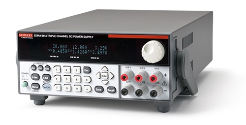
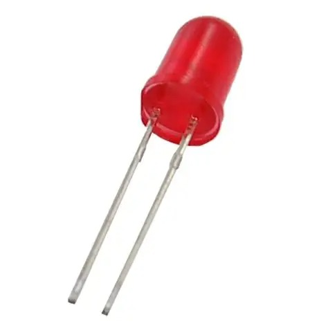
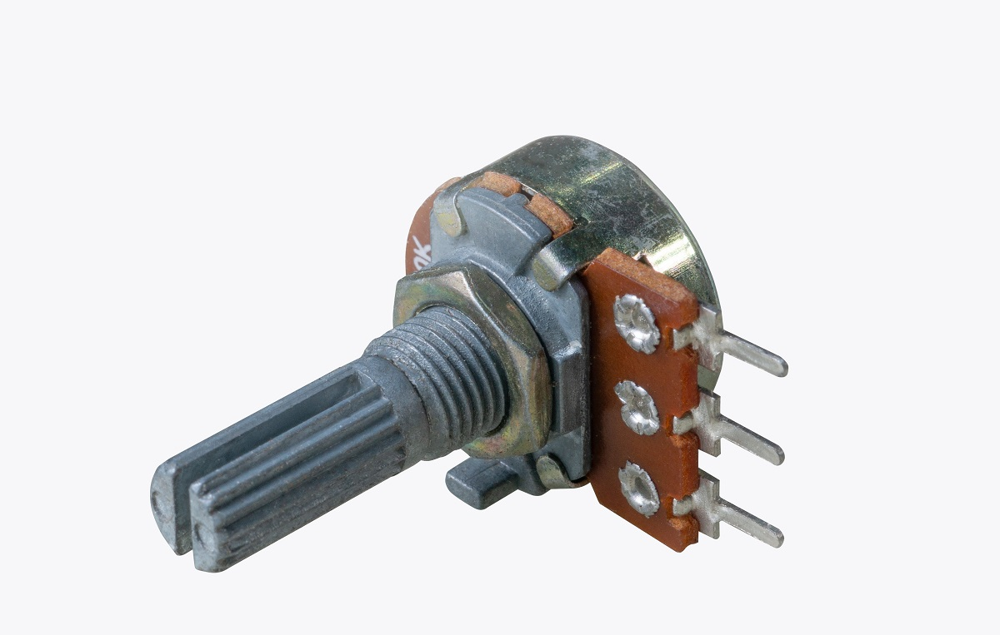
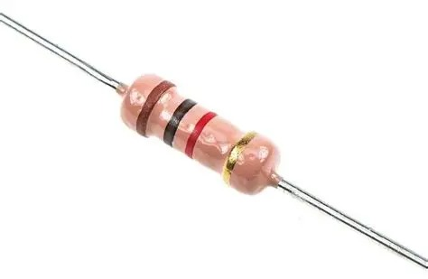
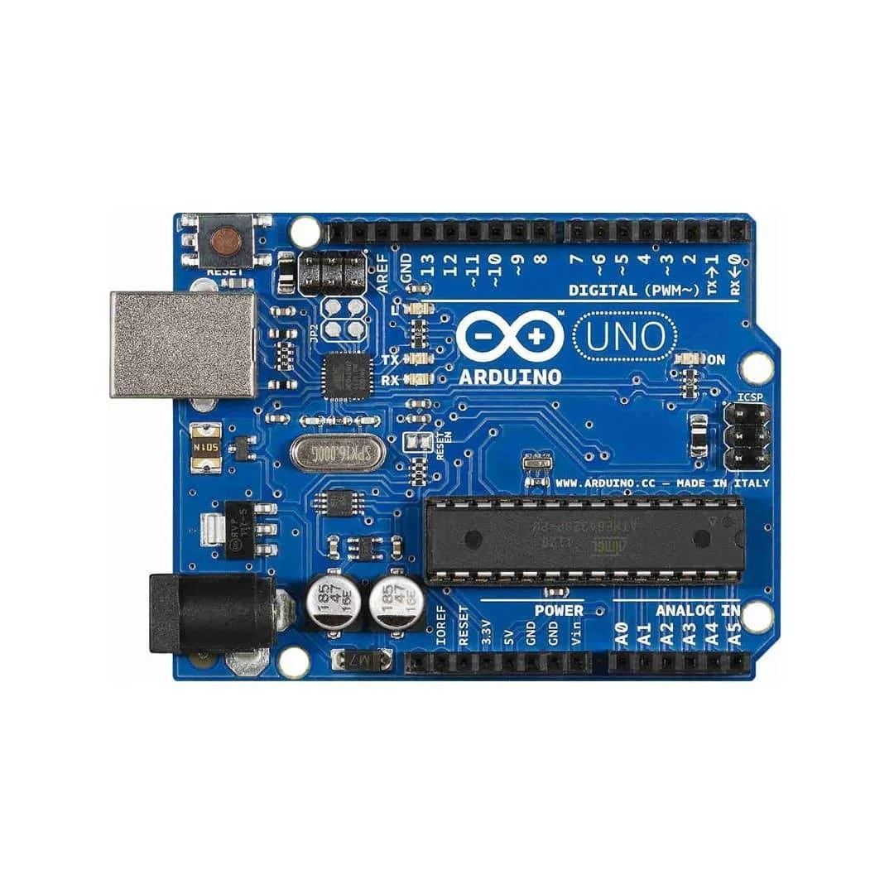
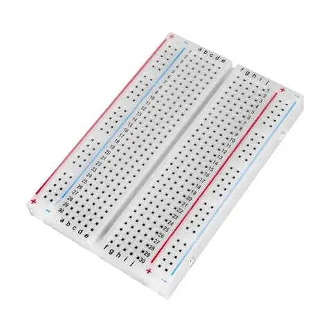
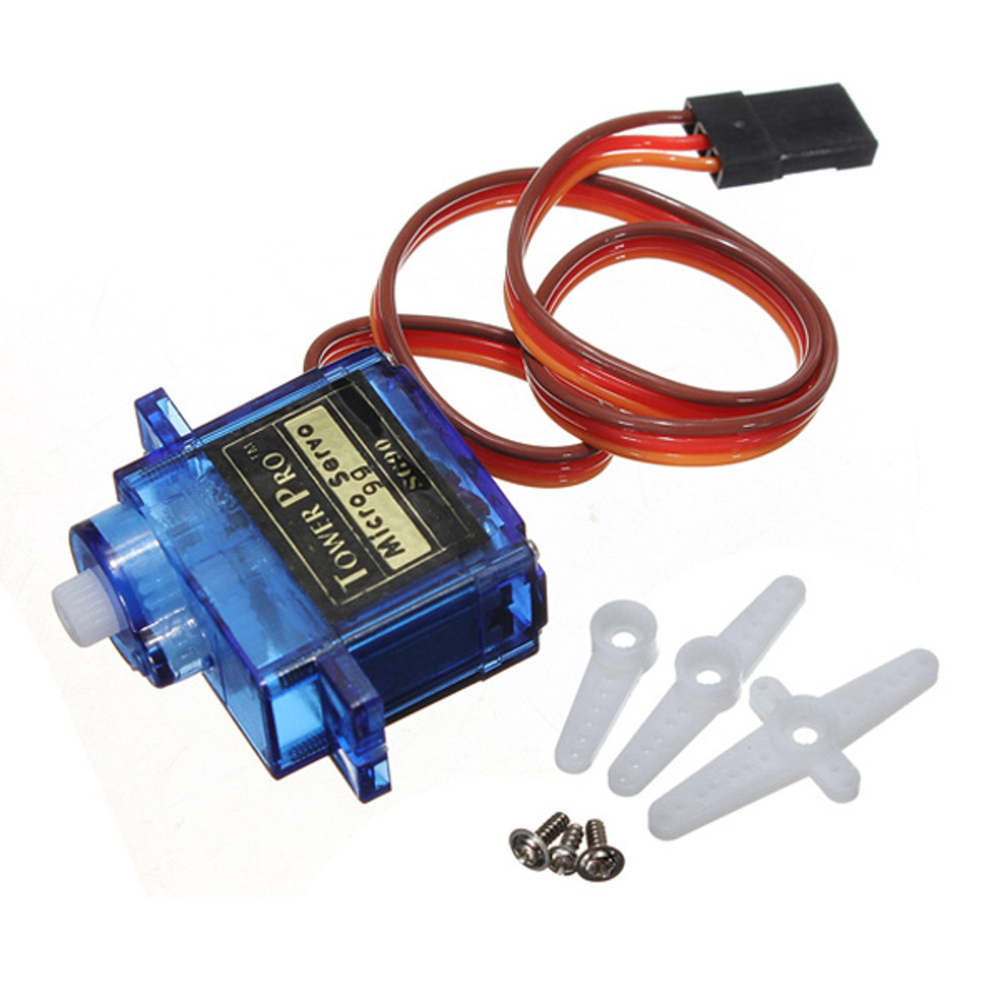
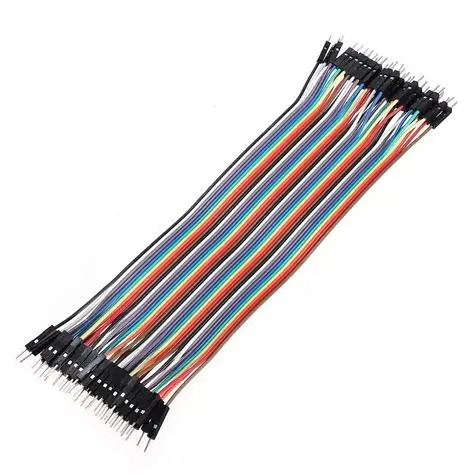
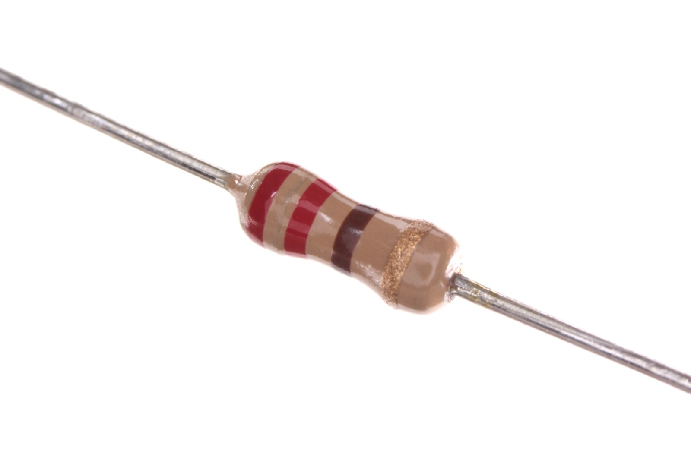

Lista de materiales:
* Tarjeta Arduino: placa programable que controla el funcionamiento del proyecto mediante el código cargado desde la computadora.     
* Cable USB-A a USB-B: se utiliza para conectar la tarjeta Arduino a la computadora, cargar los programas y, en algunos casos, proporcionar alimentación eléctrica.    
* Protoboard: tablero de pruebas que permite realizar conexiones electrónicas sin necesidad de soldar.     
* Jumpers: cables pequeños empleados para unir los componentes entre sí y con los pines de Arduino.    
* LEDs: diodos emisores de luz que sirven como indicadores visuales o para realizar prácticas de encendido y apagado.    
* Botones: interruptores que permiten enviar una señal de entrada al Arduino cuando se presionan.    
* Resistencias: componentes que limitan el paso de corriente y protegen elementos como LEDs, botones y circuitos.     
* Display de 7 segmentos: dispositivo formado por siete LEDs que permite mostrar números del 0 al 9.    
* Servomotores: motores que pueden girar a posiciones específicas y controladas por Arduino.     
* Potenciómetros: resistencias variables que permiten modificar una señal eléctrica, por ejemplo para regular la intensidad de una luz o la posición de un servomotor.    
* Fuente de poder: suministra la energía necesaria para alimentar el Arduino y los componentes del circuito.    
* Push button: botón que envía una señal al Arduino al presionarlo.    

# Reporte
## 0_Ejemplo Blink.  
Esto nos deja observar como el arduino ya está funcional, dado que el Led parpadea.

**Código:**
// C++ code
//
void setup()
{
  pinMode(LED_BUILTIN, OUTPUT);
}

void loop()
{
  digitalWrite(LED_BUILTIN, HIGH);   

  delay(1000); // Wait for 1000 millisecond(s).   

  digitalWrite(LED_BUILTIN, LOW);    

  delay(1000); // Wait for 1000 millisecond(s).  

}

**Foto**

**Video**

## 1_Salida Digital High.  
El código generó que el Led se mantuviera encendido

**Código**
// C++ code.  

//
void setup().  

{
  pinMode(13, OUTPUT);   

}

void loop()
{
  digitalWrite(13, HIGH);
}

**Foto**

**Video**

## 2_Salida Digital Low.    
Se configuro el Led para estar apagado

**Código**
// C++ code
//
void setup()
{
  pinMode(13, OUTPUT);
}

void loop()
{
  digitalWrite(13, LOW);
}

**Foto**

**Video**

## 3_Salida Digital Delay.  
Se atrasó 1 segundo al Led

**Código**
// C++ code
//
void setup()
{
  pinMode(13, OUTPUT);
}

void loop()
{
  digitalWrite(13, HIGH);
  delay(1000); // Wait for 1000 millisecond(s)
  digitalWrite(13, LOW);
  delay(1000); // Wait for 1000 millisecond(s)
}

*+Foto**

**Video**

## 4_Salida Digital Led.   
Se programó para que el Led parpadeara al estar directo al arduino

**Código**
// C++ code
//
void setup()
{
  pinMode(13, OUTPUT);
}

void loop()
{
  digitalWrite(13, HIGH);
  delay(1000); // Wait for 1000 millisecond(s)
  digitalWrite(13, LOW);
  delay(1000); // Wait for 1000 millisecond(s)
}

**Foto**

**Video**

## 5_Salida Digital Protoboard.  
Se colocó una resistencia para proteger al Led

**Código**
// C++ code
//
void setup()
{
  pinMode(13, OUTPUT);
}

void loop()
{
  digitalWrite(13, HIGH);
  delay(1000); // Wait for 1000 millisecond(s)
  digitalWrite(13, LOW);
  delay(1000); // Wait for 1000 millisecond(s)
}

**Foto**

**Video**

## 6_Salida Digital Leds I.  
Se hizo que 2 leds parpadearan consecutivamente junto con sus resistencias.

**Código**
// C++ code
//
void setup()
{
  pinMode(13, OUTPUT);
}

void loop()
{
  digitalWrite(13, HIGH);
  delay(1000); // Wait for 1000 millisecond(s)
  digitalWrite(13, LOW);
  delay(1000); // Wait for 1000 millisecond(s)
}

**Foto**

**Video**

## 7_Salida Digital Leds II.  
Los Leds se sincronizan para parpadear

**Código**
// C++ code
//
void setup()
{
  pinMode(13, OUTPUT);
  pinMode(12, OUTPUT);
}

void loop()
{
  digitalWrite(13, HIGH);
  delay(1000); // Wait for 1000 millisecond(s)
  digitalWrite(13, LOW);
  delay(1000); // Wait for 1000 millisecond(s)
  digitalWrite(12, HIGH);
  delay(1000); // Wait for 1000 millisecond(s)
  digitalWrite(12, LOW);
  delay(1000); // Wait for 1000 millisecond(s)
}

**Foto**
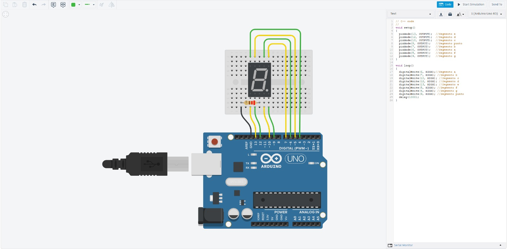  

**Video**

## 8_Salida Digital Display 7 Segmentos.  
Conectamos el display de 7 segmentos para que mostrara el número 9. El código enviaba señales HIGH y LOW a los pines necesarios para lograrlo.   

**Código**
// C++ code
//
void setup()
{
  pinMode(13, OUTPUT);	//Segmento e
  pinMode(12, OUTPUT);	//Segmento d
  pinMode(10, OUTPUT);	//Segmento c
  pinMode(9, OUTPUT);	//Segmento punto
  pinMode(7, OUTPUT);	//Segmento b
  pinMode(6, OUTPUT);	//Segmento a
  pinMode(5, OUTPUT);	//Segmento f
  pinMode(4, OUTPUT);	//Segmento g
}

void loop()
{
  digitalWrite(6, HIGH);//Segmento a
  digitalWrite(7, HIGH); //Segmento b
  digitalWrite(10, HIGH); //Segmento c
  digitalWrite(12, HIGH); //Segmento d
  digitalWrite(13, HIGH); //Segmento e
  digitalWrite(5, HIGH); //Segmento f
  digitalWrite(4, HIGH); //Segmento g
  digitalWrite(9, HIGH); //Segmento punto
  delay(1000);
}

**Foto**
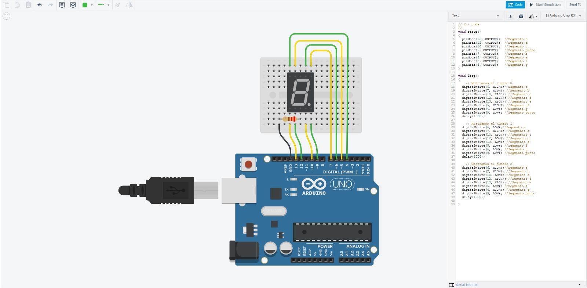  

**Video**

## 9_Salida Digital Display 7 Segmentos.  
Se hizo un conteo de 1 al 3.  

**Código**
// C++ code
//
void setup()
{
  pinMode(13, OUTPUT);	//Segmento e
  pinMode(12, OUTPUT);	//Segmento d
  pinMode(10, OUTPUT);	//Segmento c
  pinMode(9, OUTPUT);	//Segmento punto
  pinMode(7, OUTPUT);	//Segmento b
  pinMode(6, OUTPUT);	//Segmento a
  pinMode(5, OUTPUT);	//Segmento f
  pinMode(4, OUTPUT);	//Segmento g
}

void loop()
{
  digitalWrite(6, HIGH);//Segmento a
  digitalWrite(7, HIGH); //Segmento b
  digitalWrite(10, HIGH); //Segmento c
  digitalWrite(12, HIGH); //Segmento d
  digitalWrite(13, HIGH); //Segmento e
  digitalWrite(5, HIGH); //Segmento f
  digitalWrite(4, HIGH); //Segmento g
  digitalWrite(9, HIGH); //Segmento punto
  delay(1000);
}

**Foto**
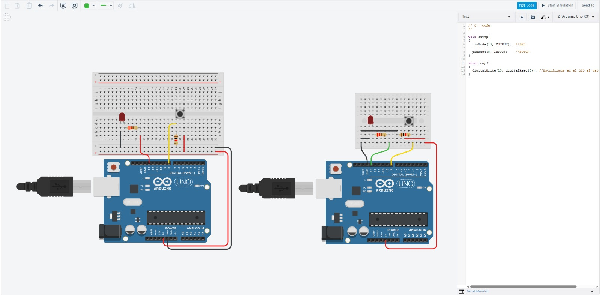  

**Video**

## 10_Entrada Digital Boton. 
Hicimos que un botón encendiera el Led

**Código**
// C++ code
//

void setup()
{
  pinMode(13, OUTPUT);	//LED
  
  pinMode(8, INPUT);	//BOTON
}

void loop()
{
  digitalWrite(13, digitalRead(8)); //Escribimpos en el LED el valor del BOTON
}  

**Foto**
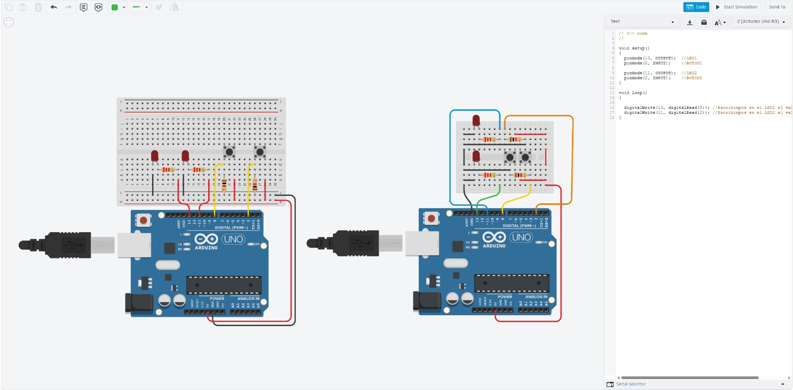  

**Video**

## 11_Entrada Digital 2 Botones.  
Generamos un circuito que se encendiera con 2 botones

**Código**
// C++ code
//

void setup()
{
  pinMode(13, OUTPUT);	//LED1
  pinMode(8, INPUT);	//BOTON1
  
  pinMode(11, OUTPUT);	//LED2
  pinMode(2, INPUT);	//BOTON2
}

void loop()
{
  
  digitalWrite(13, digitalRead(8)); //Escribimpos en el LED1 el valor del BOTON1
  digitalWrite(11, digitalRead(2)); //Escribimpos en el LED2 el valor del BOTON2
}

**Foto**
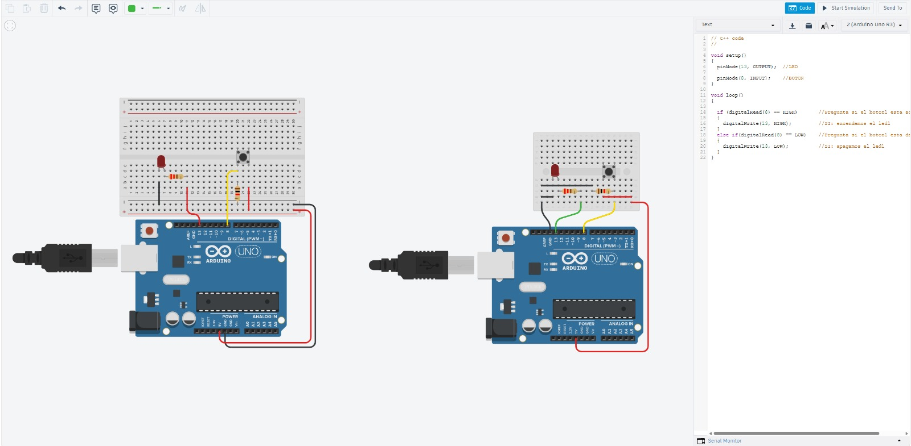  

**Video**

## 12_Entrada Digital Condicionales Boton.  
Cuando se pulsa el botón, se enciende el Led

**Código**
// C++ code
//

void setup()
{
  pinMode(13, OUTPUT);	//LED
  
  pinMode(8, INPUT);	//BOTON
}

void loop()
{
  
  if (digitalRead(8) == HIGH)		//Pregunta si el boton1 esta activado
  {
    digitalWrite(13, HIGH);			//SI: encendemos el led1
  }
  else if(digitalRead(8) == LOW)	//Pregunta si el boton1 esta desactivado
  {
    digitalWrite(13, LOW);			//SI: apagamos el led1
  }
}
**Foto**
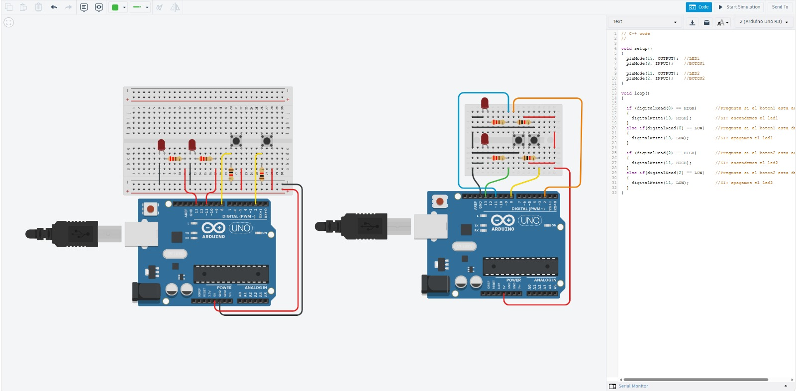  

**Video**

## 13_Entrada Digital Condicionales 2 Botones.  
Se enciende el Led con 2 botones

**Código**
// C++ code
//

void setup()
{
  pinMode(13, OUTPUT);	//LED1
  pinMode(8, INPUT);	//BOTON1
  
  pinMode(11, OUTPUT);	//LED2
  pinMode(2, INPUT);	//BOTON2
}

void loop()
{
  
  if (digitalRead(8) == HIGH)		//Pregunta si el boton1 esta activado
  {
    digitalWrite(13, HIGH);			//SI: encendemos el led1
  }
  else if(digitalRead(8) == LOW)	//Pregunta si el boton1 esta desactivado
  {
    digitalWrite(13, LOW);			//SI: apagamos el led1
  }
  
  if (digitalRead(2) == HIGH)		//Pregunta si el boton2 esta activado
  {
    digitalWrite(11, HIGH);			//SI: encendemos el led2
  }
  else if(digitalRead(2) == LOW)	//Pregunta si el boton2 esta desactivado
  {
    digitalWrite(11, LOW);			//SI: apagamos el led2
  }
}
**Foto**
  

**Video**

## 14_Condicionales OR Boton.  
Si uno o ambos botones estaban presionados, entonces el LED se encendía.

**Código**
// C++ code
//

void setup()
{
  //Inicializamos puertos
  pinMode(13, OUTPUT);	//LED1
  
  pinMode(8, INPUT);	//BOTON1
  pinMode(2, INPUT);	//BOTON2
}

void loop()
  
{
  if (digitalRead(8) == HIGH || digitalRead(2) == HIGH)		//Pregunta si se cumple la condición
  {
    digitalWrite(13, HIGH);			//SI: encendemos el led1
  }
  else	//En caso contrario
  {
    digitalWrite(13, LOW);			//NO: apagamos el led1
  }

}

**Foto**
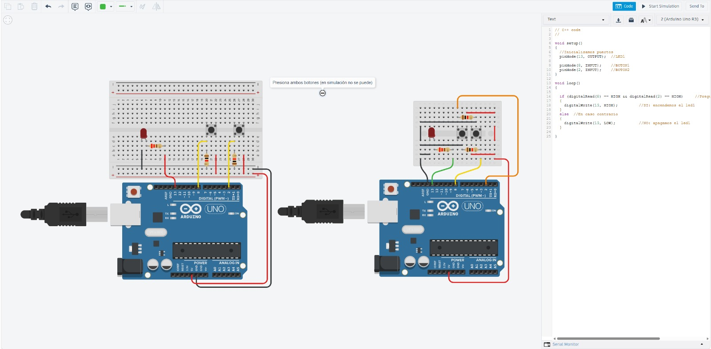  

**Video**

## 15_Condicionales AND Botones.  
Se encendía el Led al presionar ambos botones

**Código**
// C++ code
//

void setup()
{
  //Inicializamos puertos
  pinMode(13, OUTPUT);	//LED1
  
  pinMode(8, INPUT);	//BOTON1
  pinMode(2, INPUT);	//BOTON2
}

void loop()
{
  
  if (digitalRead(8) == HIGH && digitalRead(2) == HIGH)		//Pregunta si se cumple la condición
  {
    digitalWrite(13, HIGH);			//SI: encendemos el led1
  }
  else	//En caso contrario
  {
    digitalWrite(13, LOW);			//NO: apagamos el led1
  }

}

**Foto**
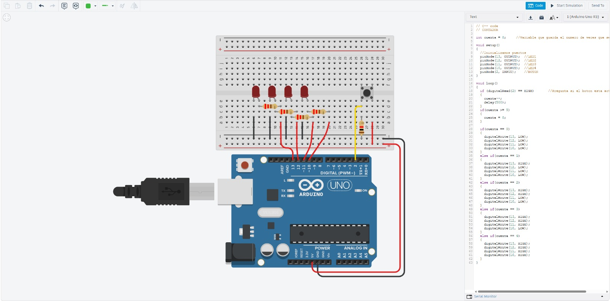  

**Video**

## 16_Contador Leds.  
Se encendían los Leds como si se estuvieran enumerando.

**Código**
// C++ code
// CONTADOR

int cuenta = 0;		//Variable que guarda el numero de veces que se ha contado

void setup()
{
  //Inicializamos puertos
  pinMode(13, OUTPUT);	//LED1
  pinMode(12, OUTPUT);	//LED2
  pinMode(11, OUTPUT);	//LED3
  pinMode(10, OUTPUT);	//LED4
  pinMode(2, INPUT);	//BOTON
}

void loop()
{
  if (digitalRead(2) == HIGH)		//Pregunta si el boton esta activado
  {
    cuenta++;
    delay(500);
  }
  if(cuenta >= 5)
  {
    cuenta = 0;
  }
  
  if(cuenta == 0)
  {
  	digitalWrite(13, LOW);
    digitalWrite(12, LOW);
    digitalWrite(11, LOW);
    digitalWrite(10, LOW);
  } 
  else if(cuenta == 1)
  {
  	digitalWrite(13, HIGH);
    digitalWrite(12, LOW);
    digitalWrite(11, LOW);
    digitalWrite(10, LOW);
  } 
  else if(cuenta == 2)
  {
  	digitalWrite(13, HIGH);
    digitalWrite(12, HIGH);
    digitalWrite(11, LOW);
    digitalWrite(10, LOW);
  }
  else if(cuenta == 3)
  {
  	digitalWrite(13, HIGH);
    digitalWrite(12, HIGH);
    digitalWrite(11, HIGH);
    digitalWrite(10, LOW);
  }
  else if(cuenta == 4)
  {
  	digitalWrite(13, HIGH);
    digitalWrite(12, HIGH);
    digitalWrite(11, HIGH);
    digitalWrite(10, HIGH);
  }
}

**Foto**
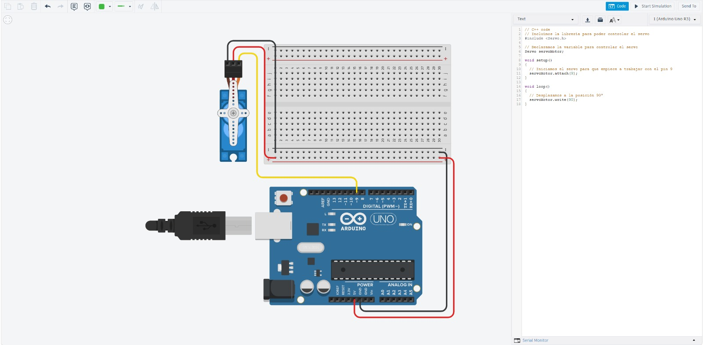  

**Video**

## 17_Servo.  
El servomotor siempre tenía un ángulo de 0°

**Código**
// C++ code
// Incluímos la librería para poder controlar el servo
#include <Servo.h>

// Declaramos la variable para controlar el servo
Servo servoMotor;

void setup()
{ 
  // Iniciamos el servo para que empiece a trabajar con el pin 9
  servoMotor.attach(9);
}

void loop()
{
  // Desplazamos a la posición 90º
  servoMotor.write(90);
}

**Foto**
  

**Video**
## 18_Servomotor Varias Posiciones.  
El servomotor se movía de posición cada cierto tiempo.

**Código**
// C++ code
// Incluímos la librería para poder controlar el servo
#include <Servo.h>

// Declaramos la variable para controlar el servo
Servo servoMotor;

void setup()
{
  // Iniciamos el servo para que empiece a trabajar con el pin 9
  servoMotor.attach(9);
}

void loop()
{
  // Desplazamos a la posición 0º
  servoMotor.write(0);
  // Esperamos 1 segundo
  delay(1000);
  
  // Desplazamos a la posición 90º
  servoMotor.write(90);
  // Esperamos 1 segundo
  delay(1000);
  
  // Desplazamos a la posición 180º
  servoMotor.write(180);
  // Esperamos 1 segundo
  delay(1000);
}

**Foto**
  

**Video**
## 19_Servomotor y Potenciómetro.  
Se hizo un circuito donde el potenciómetro controla el movimiento del servo, de 0 a 180 grados. En el código se ajustan los valores que recibe el servo según el voltaje, de 0 a 5 V.

**Código**
// C++ code
// Incluímos la librería para poder controlar el servo
#include <Servo.h>

// Declaramos la variable para controlar el servo
Servo servoMotor;
int valor;		//variable que almacena la lectura analógica raw
int pos;        //Variable que almacena la posicion del servo

void setup()
{
  // Iniciamos el servo para que empiece a trabajar con el pin 9
  servoMotor.attach(9);
}

void loop()
{
  // leemos del pin A0 valor
  valor = analogRead(A0);
  //Convertimos el valor del potenciometro a una 
  //que entienda el servo
  pos = map(valor, 0, 1023, 0, 180);
  //Mandamos la posicion al servo 
  servoMotor.write(pos);
  // Esperamos 1 segundo
  delay(1000);
}

**Foto**
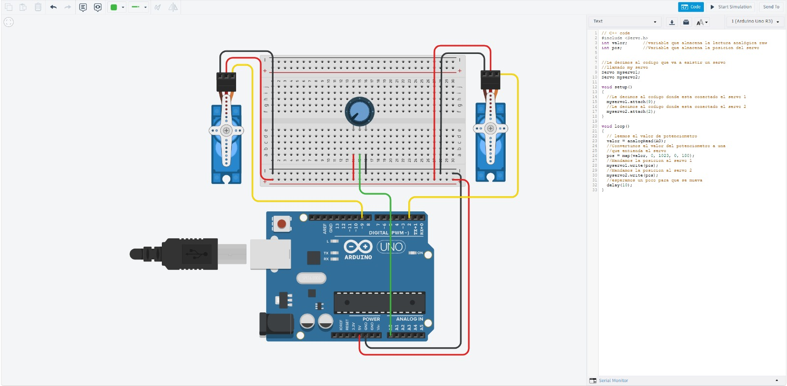  

**Video**
## 19_2_Servomotores y un Potenciómetro.  
Se controlan 2 servomotores con los potenciómetros

**Código**
// C++ code
#include <Servo.h>
int valor;		//variable que almacena la lectura analógica raw
int pos;        //Variable que almacena la posicion del servo

//Le decimos al codigo que va a existir un servo
//llamado my servo
Servo myservo1;
Servo myservo2;

void setup()
{
  //Le decimos al codigo donde esta conectado el servo 1
  myservo1.attach(9);
  //Le decimos al codigo donde esta conectado el servo 2
  myservo2.attach(2);
}

void loop()
{
  // leemos el valor de potenciometro
  valor = analogRead(A0);
  //Convertimos el valor del potenciometro a una 
  //que entienda el servo
  pos = map(valor, 0, 1023, 0, 180);
  //Mandamos la posicion al servo 1
  myservo1.write(pos);
  //Mandamos la posicion al servo 2
  myservo2.write(pos);
  //esperamos un poco para que se mueva
  delay(10);
}

**Foto**
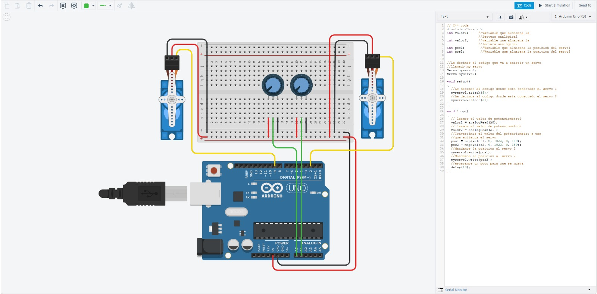  

**Video**
## 20_Servomotores y 2 Potenciómetros.  
Se controlaron 2 servomotorees independientemente con 2 potenciómetros

**Código**
// C++ code
#include <Servo.h>
int valor1;		//variable que almacena la 
				//lectura analógica1
int valor2;		//variable que almacena la 
				//lectura analógica2
int pos1;        //Variable que almacena la posicion del servo1
int pos2;        //Variable que almacena la posicion del servo2

//Le decimos al codigo que va a existir un servo
//llamado my servo
Servo myservo1;
Servo myservo2;

void setup()
{
  //Le decimos al codigo donde esta conectado el servo 1
  myservo1.attach(9);
  //Le decimos al codigo donde esta conectado el servo 2
  myservo2.attach(2);
}

void loop()
{
  // leemos el valor de potenciometro1
  valor1 = analogRead(A0);
  // leemos el valor de potenciometro2
  valor2 = analogRead(A1);
  //Convertimos el valor del potenciometro a una 
  //que entienda el servo
  pos1 = map(valor1, 0, 1023, 0, 180);
  pos2 = map(valor2, 0, 1023, 0, 180);
  //Mandamos la posicion al servo 1
  myservo1.write(pos1);
  //Mandamos la posicion al servo 2
  myservo2.write(pos2);
  //esperamos un poco para que se mueva
  delay(10);
}

**Foto**
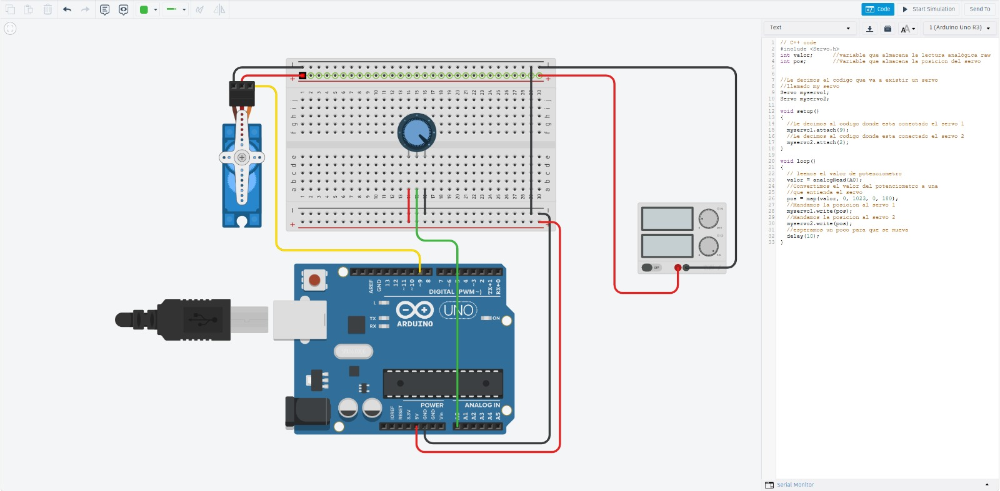  

**Video**
## 21_Fuente Externa.  
Se controlaron 2 servomotores simultaneamente con una fuente externa.

**Código**
// C++ code
#include <Servo.h>
int valor;		//variable que almacena la lectura analógica raw
int pos;        //Variable que almacena la posicion del servo

//Le decimos al codigo que va a existir un servo
//llamado my servo
Servo myservo1;
Servo myservo2;

void setup()
{
  //Le decimos al codigo donde esta conectado el servo 1
  myservo1.attach(9);
  //Le decimos al codigo donde esta conectado el servo 2
  myservo2.attach(2);
}

void loop()
{
  // leemos el valor de potenciometro
  valor = analogRead(A0);
  //Convertimos el valor del potenciometro a una 
  //que entienda el servo
  pos = map(valor, 0, 1023, 0, 180);
  //Mandamos la posicion al servo 1
  myservo1.write(pos);
  //Mandamos la posicion al servo 2
  myservo2.write(pos);
  //esperamos un poco para que se mueva
  delay(10);
}

**Foto**
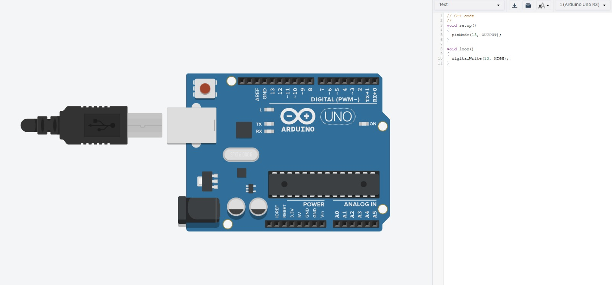  

**Video**

## Conclusión general
En conclusión, me gustaría mencionar las distintas cosas que aprendí a lo largo de la práctica con arduinos.   
1. Qué es un Arduino, sus usos y modo de programarlo.   
2. Cómo armar los circuitos en el protoboard y conectarlo al arduino
3. Para que funciona cada componente.
4. Cómo subir a github fotos y videos
Asímismo, creo que la práctica me permitió claridad en el tema sobre el arduino, sin embargo, me hace falta mucha prácrica o tal vez teoría sobre el armado de los circuitos.